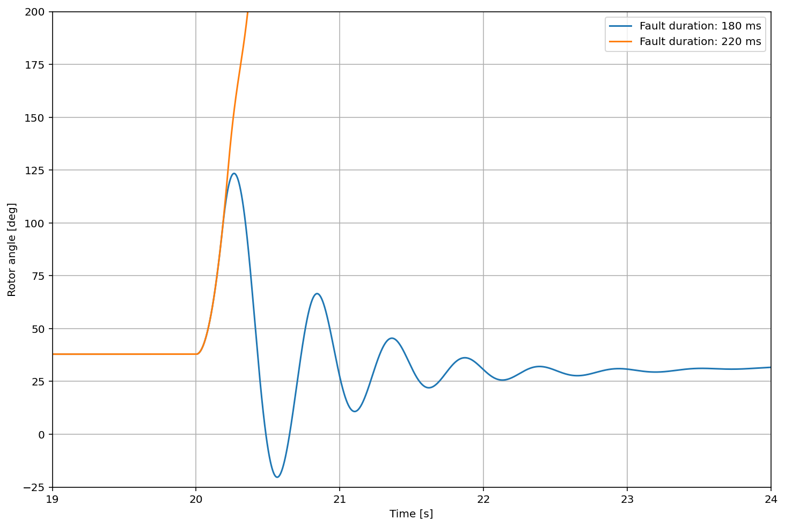

# Project Description
This is a tool for making simulations of the fault ride through capability (FRT), which is presented in milliseconds, of a synchronous machine connected to a power system.

Each evaluation of the FRT capability consists of several simulations where the fault duration is increased until the machine looses synchronism with the power system.

The FRT capability depends on several characteristics of the machine and power system, i.e. the inertia of the machine, reactances of the machine and step-up transformer, degree of excitation, voltage level in the power system, etc.

The idea is to study the effect on FRT capability in the U-Q window, i.e the operating point of the synchronous machine with respect to voltage and reactive power. At each different operating point perform a set of time domain simulations to evaluate the FRT capability. The result will be presented as "iso curves" (curves corresponding to the same FRT capability), in a U-Q plot. These will be created using the matplotlib contour() command.

The time to build ut the U-Q plot should be optimised.

## Alternative implementation
Instead of restricting to the U-Q plane, the analysis could also be extended to the 3d space by varying the active power P, so that for each operating point (P, Q, U) the FRT capablity is calculated. Plotting of the FRT capability could then be done as contours in a selected plane; U-Q, P-Q or U-P.

## Model description
The simulation model is a Functional Mock-up Unit (FMU) model created in, and exported from, OpenModelica. The Python package FmPy is used to parametrise and run time domain simulations on the model in Python.

Results are saved as variables that can be cast to numpy arrays for further analysis.

## Example calculation
In the figure below the rotor angle of the machine is plotted for two different fault durations; 180 ms and 220 ms. At 180 ms the machine remains in synchronism with the power system, at 220 ms it falls out of phase.

## Dependiencies
The project is dependent on the following packages
- FmPy
- Numpy
- Matplotlib
- Pandas

## References
Read more about FMU at fmi-standard.org
